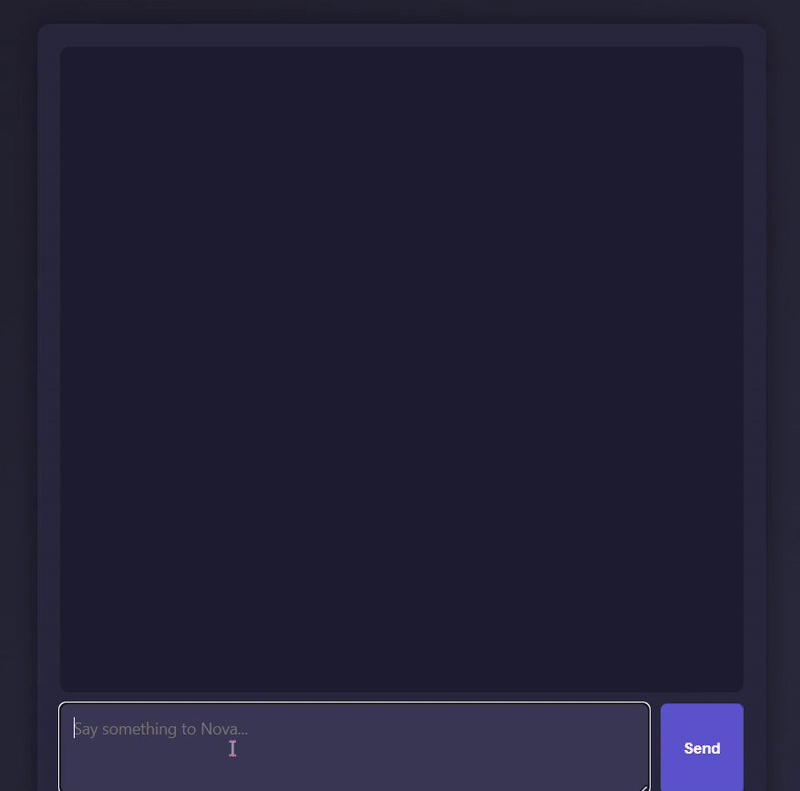

# 💡 Very-Very-Light-Chatbot

A super lightweight, **local chatbot** project designed for desktop/laptop use — ideal for minimal setups and quick testing.

> 🛠️ **This is my first chatbot project**, but it has been **refined and optimized** to be shared here publicly for others to explore and learn from.

---

## 🚀 Features

- 💬 Local LLM chatbot powered by [Ollama](https://ollama.com)
- 🧠 Custom memory via `memory.json`
- 📝 Chat and journal history saved in `chat_history.json`
- ⚡ Super lightweight and clean architecture
- 📦 Uses models directly pulled from Ollama (no LM Studio required)
- 🖥️ Optimized for laptops and desktops (offline-capable)
- 🔧 Built for simplicity and extensibility

---

## 🎞️ Demo Preview

Here’s a look at the chatbot running locally:



---

## 🖥️ System Requirements

> 💡 This chatbot was developed and tested on the following specs:

- 🔹 Intel Core **i5-13420H**
- 🔹 **RTX 4050** Laptop GPU
- 🔹 **16GB RAM**
- 🔹 Windows 11

Minimum recommended:

- ✅ Quad-core CPU
- ✅ 8–16GB RAM
- ✅ Optional: Discrete GPU (for faster performance)
- ✅ Smaller quantized models (like Phi-2) work well on modest hardware

---

## 📁 Folder Structure

```
├── app.py                  # Main Flask app
├── brain.py                # Core chatbot flow and logic
├── functions/              # Modular helper functions
│   ├── __init__.py
│   ├── history_func.py     # Manages conversation history
│   ├── journal_func.py     # Handles journaling features
│   ├── memory_func.py      # Memory system logic
│   ├── model_runner.py     # Interacts with LLM via Ollama
│   └── prompt.py           # Prompt creation/injection
├── templates/
│   ├── index.html          # Main chat UI
│   └── history.html        # Journal/history viewer
├── static/
│   ├── style.css           # Basic CSS styling
│   └── script.js           # Frontend behavior
├── memory.json             # Persistent chatbot memory
├── chat_history.json       # Stored conversation/journal logs
├── demo.gif                # Optional: Local UI preview
```

---

## 🧠 Ollama-Based Model Setup

This project skips the LM Studio step and directly uses Ollama to pull and run the model:

### 🔹 Step 1: Install Ollama

Download and install from [https://ollama.com](https://ollama.com)

### 🔹 Step 2: Pull Model (e.g. Phi-2)

```bash
ollama pull phi:2
```

> 🧠 This project uses the **Phi-2** model for its balance of speed and performance. Feel free to swap in other models (like `mistral`, `llama3`, or others).

### 🔹 Step 3: Run the Model

```bash
ollama run phi:2
```

Your local model is now running and ready for chat.

---

## 🔧 How to Run the App

### 1. Clone the Project

```bash
git clone https://github.com/yourusername/very-very-light-chatbot.git
cd very-very-light-chatbot
```

### 2. Create Virtual Environment (Optional)

```bash
python -m venv venv
venv\Scripts\activate   # On Windows
# OR
source venv/bin/activate  # On Mac/Linux
```

### 3. Install Flask

```bash
pip install flask
```

### 4. Start Ollama + Run Flask App

Make sure Ollama is running your model (`phi:2` or another):

```bash
ollama run phi:2
python app.py
```

### 5. Open in Browser

Go to:

```
http://localhost:11434
```

---

## ✅ Check Your Versions

```bash
python --version
flask --version
ollama --version
```

## ✉️ Contact

Built with ❤️ by **yubedaoneineed/Pranziss**

This is my first public chatbot project — feel free to fork, star ⭐, or reach out with feedback or ideas!
